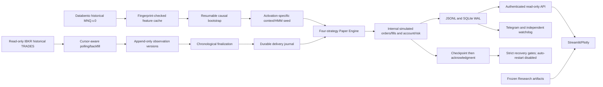

# MNQ Quant System

A four-strategy research and delayed Paper Trading system for Micro E-mini Nasdaq-100 futures. Historical research, causal inference, internal execution simulation and read-only monitoring have separate data and recovery boundaries.

**PAPER ONLY. IBKR is a read-only market-data transport. No broker orders or real-money execution are enabled.** Backtests, reconstructed simulations and forward Paper observations are distinct evidence sets.

## Architecture



No browser-to-database access, dashboard order endpoints or broker execution connection exist. Future LIVE monitoring interfaces remain disabled.

## Strategies and causal HMM

| Strategy | Role | Regime contract |
|---|---|---|
| MRL1 | Long mean reversion | Raw fitted HMM component 1 |
| MRS2 | Short mean reversion | Raw fitted HMM component 2 |
| S2R | Short regime strategy | Raw fitted HMM component 2 |
| ORB | New York opening-range breakout | Existing opening-range/session rules |

Production uses sequential forward filtering over completed, finite observations. Features are realized volatility at 5/15/30/60 bars and variance ratios 5/30 and 5/60. Population StandardScaler scaling is consistent between production training and inference. MR uses expanding training and four-calendar-month refits; S2R uses rolling two-year training and three-calendar-month refits. Training strictly precedes activation. Raw component IDs are retained without semantic alignment across fits.

Frozen Research retains its original historical fitting/decoding methodology. Research execution parity does not establish causal HMM parity. Causal acceptance is provisional: the multi-year pseudo-live experiment was interrupted; bounded fitted-model, refit and crash/restart tests provide engineering evidence.

## Historical evidence

### Frozen common OOS portfolio

**2020-06-23 through 2026-06-19**, independently reproduced from validated Research artifacts:

| Metric | Research OOS |
|---|---:|
| Trades | 3,255 |
| Cumulative result | +289.66R |
| Expectancy | +0.08899R/trade |
| Profit factor | 1.216 |
| Win rate | 50.66% |
| Maximum drawdown | −18.09R |

Counts: MRL1 430, MRS2 863, S2R 520, ORB 1,442. The dashboard verifies reproduction reports and source hashes. Research units are risk multiples, not account dollars.

### Frozen Research/Paper replay

2,899 exact Paper executions, 356 legitimate account/risk-gated non-executions, zero unexplained mismatches and zero Paper extras. This replay reproduces Research states; it is separate from causal forward operation.

### Historical simulation extension and forward Paper

Canonical local history contains 2,619,604 observed bars, **2019-05-05 22:03 UTC through 2026-10-08 13:02 UTC**. The requested historical extension is **2026-06-20 inclusive through 2026-10-08 exclusive**. Its 107,280 observed bars start June 21 at 22:00 UTC and end October 7 at 23:59 UTC. An absent trade-derived OHLCV minute is not automatically a missing required observation.

The extension pipeline reuses the engine, cost profile, seed loader and checkpoint recovery. **Extension performance is not yet validated:** a June 20 activation-specific seed and reviewed calendar are required. The October seed cannot initialize June without future information. No extension returns are interpolated or added to the frozen benchmark.

Forward delayed Paper starts October 8, 2026 with a fresh simulated account. Its account, positions, trades and costs come only from that run. Research R and Paper USD are never concatenated. R diagnostics disclose different cost/selection assumptions and retain separate traces. One closed forward trade is insufficient for an alpha-decay conclusion.

## Data quality and CME calendar

The strict historical certificate remains separate from the explicit `paper_research_quality_accepted` policy. The latter records user-accepted degraded-source uncertainty for internal simulation, preserves source hashes and rejects corrupted, invalid or nonchronological observations. It does not certify complete capture, synthesize bars or authorize LIVE.

Snapshots use America/New_York semantics and timezone-aware DST conversion; official CME evidence reports America/Chicago hours. Snapshots and adjacent review records are under `src/paper/config/`. The active run is pinned to October 8–31, 2026. Separately reviewed November 1–24 and November 28–30 snapshots include DST and Veterans Day; they are not installed into the active run. November 25–27 Thanksgiving phases are preserved as official evidence but remain uncovered because their extended trade-date representation needs validation. December and a future contract roll are not approved. Uncovered dates fail closed; preopen is not continuous matching.

Calendar updates: select **Full Calendar / Futures / MNQ** on [official CME Trading Hours](https://www.cmegroup.com/trading-hours.html), record exact phases/trade dates/timezone/review time, create a separate snapshot/review, validate and test boundaries, then validate deployment identity. Never infer a contract roll or replace the active calendar silently.

```powershell
.\.venv\Scripts\python.exe scripts/validate_cme_snapshot.py `
  --snapshot src/paper/config/cme_mnq_calendar_2026-11-01_2026-11-03.json `
  --review-record src/paper/config/cme_mnq_calendar_2026-11-01_2026-11-03.review.json
```

## Delayed feed, execution and recovery

The IBKR adapter pins an approved outright contract. It records exchange bar-start, observation and finalization timestamps separately, deduplicates overlaps and preserves observed revisions. Delivered bars are not silently rewritten. Conservative polling, bounded backfill and paced reconnection are supported. Socket connectivity alone is not evidence of healthy bar delivery. Demo provenance and cross-provider volume limitations remain explicit.

Orders, fills, stops/targets, fees, equity and risk gates are internal simulations. Cost profiles are versioned. Monitoring thresholds never change the engine's funded-account risk policy.

Bars are staged durably before processing; recoverable Paper state is checkpointed before delivery acknowledgment. Restart reconciles journals and cursors. Checkpoints retain HMM/context, strategy, position/order, account and risk state. Internal checksums, runtime compatibility and exclusive writer ownership are mandatory. Reporting-only compatibility is explicitly versioned; execution-critical fingerprints remain strict.

Checkpoint retries preserve authoritative envelopes and backup validation. Their opt-in installer applies only to an unstarted service. Deploying to the running Engine requires an approved controlled restart. Sidecar I/O uses bounded retries and sanitized failure logs. An unresolved supervisor launch cannot create another worker merely because cooldown expired.

## Monitoring and analytics

- Streamlit/Plotly: account, equity/drawdown, strategies, positions/orders, trade explorer, risk, costs, rolling performance and Research/forward comparisons.
- Bearer-authenticated read-only API with bounded SQLite queries.
- Persistent Telegram delivery/deduplication/retries and independent PID-identity/writer-ownership watchdog.
- Calendar-aware OPEN/CLOSED/BREAK/UNKNOWN health; provider delay, backlog and durable commits are separate metrics.
- Daily quantitative reports and checkpoint, SQLite, disk, calendar, contract and task-health maintenance.
- Alpha diagnostics use actual outcomes, historical references, disjoint looks and serial-dependence-aware blocks. Small samples are INSUFFICIENT_DATA, not statistical evidence of decay.
- Parity diagnostics distinguish changed inputs, decoding, costs and unexplained execution differences. They never optimize strategies.

Tailscale provides private mobile access. Bind only to an explicitly selected private interface and narrowly scope the firewall. Never publish TWS or monitoring credentials. Telegram secrets are configured outside Git and must not appear in shell history or repository files.

## Installation and operation

Tested: Windows x86-64 / CPython 3.13. Runtime pins: `requirements-realtime-paper-py313.lock`; dashboard uses a separate environment. Linux/systemd examples exist, but Linux/ARM64 runtime and cloud deployment are not validated. No cloud resources are provisioned.

```powershell
py -3.13 -m venv .venv
.\.venv\Scripts\python.exe -m pip install -r requirements-realtime-paper-py313.lock
.\scripts\install_paper_dashboard.ps1
$env:OMP_NUM_THREADS='1'
$env:OPENBLAS_NUM_THREADS='1'
$env:MKL_NUM_THREADS='1'
$env:LOKY_MAX_CPU_COUNT='4'
```

Configure TWS Paper, read-only API and the approved local port. Login/2FA may require the operator; automation does not bypass authentication. Readiness must pass before start/resume.

```powershell
# Status only; no Engine restart
.\scripts\mnq_paper_system.ps1 -Mode Check
.\.venv\Scripts\python.exe -m src.paper.delayed_paper_cli status `
  --output-dir results/paper/delayed_mnqz6_paper_accepted_20261008_1303_r3
.\.venv\Scripts\python.exe -m src.paper.notification_cli status
# Desktop; specify your own private address explicitly for mobile
.\scripts\start_paper_dashboard.ps1 -DashboardAddress 127.0.0.1 -NoBrowser
.\scripts\write_paper_quant_reports.ps1
# Explicit operator shutdown only
.\scripts\mnq_paper_system.ps1 -Mode Stop
```

Task Scheduler: `scripts/mnq_paper_system.ps1 -Mode Install`, `Check`, `RestartSidecars`, `Uninstall`. Tasks/firewall may need administrator permissions. **Production automatic Engine restart remains disabled until separately authorized.** Accounts are never automatically recreated. See [Windows operations](src/paper/WINDOWS_AUTONOMOUS_OPERATIONS.md) and [Paper runtime](src/paper/REALTIME_PAPER.md) for validated resume parameters, power-loss/sleep limitations and logs.

Historical extension preparation (does not start replay):

```powershell
.\.venv\Scripts\python.exe -m src.paper.historical_extension prepare `
  --certificate results/diagnostics/mnq_calendar_coverage_2019-05-05_2026-10-08_sparse_semantics_v5.json `
  --report results/diagnostics/historical_extension_preparation_v1.json
```

Existing `src.paper.causal_bootstrap_cli` supports `validate`, `benchmark`, `start`, `resume`, `status`. Preserve numerical settings, cache/source identity and coverage acceptance. See [extension procedure](docs/HISTORICAL_EXTENSION.md).

## Tests and limitations

```powershell
.\.venv\Scripts\python.exe -m pytest tests/paper -q `
  --basetemp results/diagnostics/pytest_paper
git diff --check
```

Isolated tests cover actual ORB-generated orders/fills, fitted HMM/refits, hard-process crashes, pending orders, outage catch-up, corruption/runtime mismatch, duplicate writers, read-only API, Telegram, statistics and dashboard contracts. October 11, 2026 validation: 542 Paper tests and 269 core model/strategy/risk/execution tests passed. Existing numerical-library deprecation warnings remain; they are not a claim of open-session acceptance. Exact evidence and remaining tasks are in [the progress tracker](src/paper/AUTONOMOUS_ROADMAP_PROGRESS.md).

Pending: next-open-session provider/commit progression, explicit unattended-restart authorization, active-calendar renewal, approved future contract mapping and completed historical extension validation. Full-period pseudo-live performance, LIVE, public deployment and Linux readiness are not claimed. Exclude raw data, logs, SQLite, checkpoints, journals and secrets from Git.
